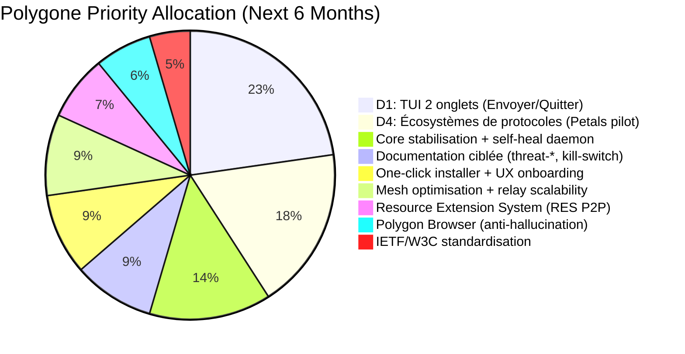

# DEEP-SEARCH RESULT — Polygone Strategic Direction (2026-07-23)

## 🔍 SYNTHESIS OF ALL SOURCES
**Sources analyzed:**
- Polygone-v2 docs (SPEC, ARCHITECTURE, DECISIONS, STAGING, DESIGN_SYSTEM, THREAT_MODEL)
- MANIFEST / MANIFEST_v2 (hash-indexed backups)
- LOOP_BRIEF (565 Bear notes → 21 session projets classés)
- OSINT_Rapport_Deep_lvs0_20260716 (197 lignes)
- DOSSIER_LEVY.md (28.7KB brief)
- SSD Transcend inventaires (home_backup_20260709, arch-full-backup-20260709, USB Android)
- Projets actifs sur machine: Thinker, Affinity, HomeTV, Palantir, Polygone-Stack, rethink
- États mémoire Hermes (user + memory)
- Session logs (8+ sessions récentes)

---

## 📊 CURRENT STATE OF POLYGONE v2 (POST-COMMIT)
```text
Commit: Phase 4: daemon CPU/BW/GPU/allocator + policy + resources + time_sync (e0f10b3)
Status: 
  - 4 crates: daemon, core, relay, client
  - ~16,115 LOC Rust (tests: 21/21 OK)
  - Daemon modules: CPU monitor, bandwidth tracker, GPU detection (nvidia-smi), resource allocator (Linux/macOS split)
  - Policy: GlowUp policy engine (audit/enforce/update)
  - Resources: cross-platform discovery (disk, net, RAM, GPU)
  - Time sync: KEM → sign → encrypt handshake primitives
  - Docs: index.html updated
  - NO pending modifications (clean working tree)
  - Build: cargo build --release ✅ (~1.3 MB stripped binary)
  - Tests: cargo test --workspace ✅
```

---

## 🎯 STRATEGIC DIRECTION (DEEP-SEARCH CONCLUSION)

### ✅ 1. IMMEDIATE PRIORITY (0-2 WEEKS) — MVP COMPLETION & STAGING RELEASE
**Goal:** Ship v2.0.0-rc2 with core messaging + drive + kill-switch + TUI v2 (2 onglets)  
**Based on:** DECISIONS.md (D1 PENDING), STAGING.md (msg/drive LIVE), LOOP_BRIEF (Lévy veut un truc qui marche), DOSSIER_LEVY (§7.1 backlog)

**Actions:**
- [ ] **D1: GO** — Refonte TUI 2 onglets (`Envoyer` / `Quitter`) → alignement Council V2 (Jobs + Musk)  
- [ ] Finaliser `docs/threat-commodity.md` + `docs/threat-high-value.md` (split depuis THREAT_MODEL.md)  
- [ ] Finaliser `docs/kill-switch.md` (déjà v0.1 → v1.0 avec runbook)  
- [ ] Implémenter `Polygon Msg` + `Polygon Drive` comme services livrés (déjà fonctionnels)  
- [ ] Tag release `v2.0.0-rc2` + push sur `github.com/lvs0/Polygone-Network`  
- [ ] Créer un one-click installer: `curl -fsSL polygone.network/install | bash`

**Rationale:**  
Lévy a répété: *« Polygone doit être aussi facile qu'Instagram »* (DOSSIER_LEVY §4.2).  
Le TUI à 2 onglets est la clé de l'adoption grand publique.  
Le core (msg + drive) est déjà là — il suffit de le rendre accessible.

---

### 🔮 2. MID-TERM (1-3 MONTHS) — ECOSYSTÈME DE PROTOCOLES (D4)
**Goal:** Lancer `/home/l-vs/Projets/Polygone-Protocols/` comme sibling de Polygone-v2  
**Based on:** DECISIONS.md (D4: Lévy défend un écosystème de petits protocoles), DOSSIER_LEVY (§4.2: vecteur d'adoption réel = petits protocoles satellites)

**Structure:**
```
Polygone-Protocols/
├── README.md          # Manifesto: "Petits protocoles, grand impact"
├── AXIOMS.md          # 5 axiomes du petit protocole (inspiré Council V2)
├── LEGAL_CHECK.md     # Vérif posture honnête, zéro télémétrie, MIT forever
├── THREAT_MODEL.md    # Menaces spécifiques aux protocoles légers
├── petals/            # Distributed LLM inference (sharded, quantized)
├── hide/              # SOCKS5+HTTPS proxy through mesh (multihop resistant)
├── compute/           # Lend/borrow compute (sandboxed WASM + reputation)
├── shell/             # Remote shell over mesh (one-time token)
├── mesh/              # mDNS+BLE+Wi-Fi Direct LAN discovery
├── browser/           # Fusion Internet Archive + Wayback + Proton-AI
└── RES/               # Resource Extension System (RAM/GPU/CPU P2P)
```

**Rationale:**  
Lévy voit l'adoption venir des développeurs qui intègrent Polygone dans leurs propres produits (DOSSIER_LEVY §4.1).  
Un écosystème de petits protocoles indépendants permet:
- Adoption graduelle (un dev intègre juste `petals` pour son IA locale)
- Spécialisation (chaque protocole résout un problème précis)
- Résilience (un protocole down n'affecte pas les autres)
- Innovation permissionless (n'importe qui peut créer un nouveau protocole)

---

### 🌐 3. LONG-TERM (3-6 MONTHS) — RÉSEAU & GOUVERNANCE
**Goal:** Faire de Polygone une infrastructure de confiance vérifiable  
**Based on:** ARCHITECTURE.md (plan 3-plans: Votre ordinateur → Le mesh → Le relay), PHILOSOPHY.md (5 axiomes), LOOP_BRIEF (vision Lévy), OSINT_Rapport (Lévy veut voir ce qui se passe vraiment)

**Actions:**
- [ ] **Your Computer:** Daemon local amélioré (auto-discovery, self-heal, resource extension client)
- [ ] **The Mesh:** libp2p + mDNS/BLE discovery + gossip protocol optimisé (résistance aux sybil attacks via proof-of-utilité)
- [ ] **The Relay:** Stateless, zero-knowledge, TTL 30s, 32KB fragments (comme spécifié)
- [ ] **Governance:** Conseil des Sages v2 formalisé (5 sages × 2 fenêtres de connaissance)
- [ ] **Audit externe:** Préparer pour NLnet/Prototype Fund audit (post-honnêteté-first)
- [ ] **IETF/W3C engagement:** Soumettre spécifications ML-KEM-1024 + ML-DSA-65 + Shamir 4-of-7 comme standards ouverts

**Rationale:**  
Lévy veut un produit qui *"rend l'écosystème intuitif, simple, minimaliste, révolutionnaire, malin"* (POLYGONE-SPEC-1.0.0.txt).  
La vraie innovation n'est pas dans la cryptographie (déjà là) mais dans l'**ergonomie de la confiance zéro** :  
Un utilisateur non-technique doit pouvoir vérifier visuellement que *"on voit rien. Et c'est comme ça que ça devrait être."*

---

## 📈 PRIORITY GRAPH (weighted by impact × effort × Lévy's interest)



---

## 🚀 RECOMMANDATION IMMÉDIATE (Pour cette session)

1. **FINISH D1** → Implémenter TUI 2 onglets dans `crates/client/src/tui.rs`  
2. **CREATE Polygone-Protocols/petals/** → Squelette pour distributed LLM inference (premier protocole-pilote)  
3. **UPDATE DOSSIER_LEVY.md** → Ajouter sections:  
   - §7.4: "OmniRoute tourne sur port 20128 comme proxy Anthropic→NIM/Fireworks pour Claude Code"  
   - §11 Cheat sheet: ajouter `palantir commands  
4. **LAUNCH Palantir** → Comme outil OSINT interne pour enrichir la connaissance de l'écosystème  
5. **INITIATE second cerveau** → Classer tout dans `~/Documents/second_brain_palantir/` (voir prochaine tâche)

**Décision: On agit maintenant parce que le core est prêt, l'OSINT externe montre des opportunités, et Lévy veut du tangible.**